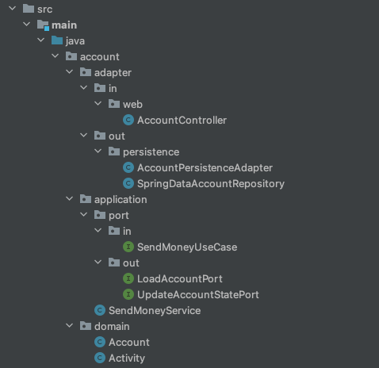

## 프로젝트 목적

계층형 아키텍처로 프로젝트 [Hotel-Java](https://github.com/korjun1993/hotel-java) 를 수행했습니다. 페어 프로그래밍으로 진행했으며 여러가지 문제점을 느끼고 클린 아키텍처 적용의 필요성을 느꼈습니다.
프로젝트를 수행하면서 표현하기 힘든 막연한 불편함을 느꼈습니다. 하지만 **만들면서 배우는 클린 아키텍처** 책을 읽고 어떤 점들이 불편했는지 명확해졌습니다.
본 프로젝트는 책에 있는 개념을 정리함과 동시에 코드를 직접 쳐보면서 클린 아키텍처에 대해 익히기 위한 목적을 갖고 있습니다.

 

## 문제점 (As-is)

---

**개발 플로우상의 문제**
- 데이터베이스의 구조를 먼저 생각하고, 이를 토대로 도메인 로직을 구현한다.
- **도메인 로직을 제대로 이해하지 못한 채로 데이터베이스 구조를 설계했다면, 도메인 로직을 구현하는 단계에 돌입했을 때, 비로소 잘못됐음을 깨닫는다.** 그리고 데이터베이스 설계부터 다시 수행한다.
- Hotel-Java 프로젝트의 데이터구조를 설계할 때 그린 ERD와 도메인 로직 개발을 마친 후 완성된 데이터베이스 구조는 많이 달랐다.

**영속성 계층과 도메인 계층이 섞이는 문제 (강한 결합 발생)**
- 데이터베이스 중심적인 아키텍처가 만들어지는 가장 큰 원인은 ORM 프레임워크를 사용하기 때문이다.
- 영속성 계층과 도메인 계층 사이에 강한 결합이 생긴다.
- 서비스는 영속성 모델을 비즈니스 모델처럼 사용하게 되고 이로 인해 도메인 로직뿐만 아니라 즉시로딩, 데이터베이스 트랜잭션, 캐시 플러시 등등 영속성 계층과 관련된 작업들을 해야한다.
- 영속성 코드가 사실상 도메인 코드에 녹아들어가서 둘 중 하나만 바꾸는 것이 어려워진다.
- Java Persistence API 에서는 ORM 이 관리하는 엔티티에 인자가 없는 기본 생성자를 추가하도록 강제한다. 이는 도메인 모델에서는 포함해서는 안 될 영속성 프레임워크에 특화된 결합의 예이다.

**동시 작업이 어려워진다**
- 계층형 아키텍처는 동시 작업을 어렵게 한다.
- 페어 프로그래밍을 해봤을 때, 동시 작업이 어렵다는 것을 느꼈다.
  - 모든 것이 영속성 계층 위에 만들어지기 때문에 영속성 계층을 먼저 개발해야 하고, 그 다음에 도메인 계층을, 그리고 마지막으로 웹 계층을 만들어야 한다.
  - 개발자들이 인터페이스를 먼저 같이 정의하고, 각 개발자들이 실제 구현을 기다릴 필요 없이 인터페이스들로 작업하면 된다고 얘기할 수도 있다. 물론 가능하지만, 데이터베이스 주도 설계를 하지 않는 경우에만 가능하다.
  - 예를 들어, 결제 도메인에 인터페이스를 다 같이 설계하고 각 개발자들이 도메인 계층, 웹 계층, 영속성 계층을 개발한다고 해보자. 도메인에 대한 이해 없이 데이터베이스를 설계했다면 인터페이스를 결국 수정해야되고, 수정된 인터페이스에 맞게 모든 계층을 다시 개발해야한다. 

 

## 해결방법 (To-be)

---

**개발 플로우에 변화를 주자**
- 비즈니스 관점에서 다른 무엇보다도 도메인 로직을 먼저 이해하고 만들어야 한다.
- 이를 기반으로 영속성 계층과 웹 계층을 만들어야 한다.

**영속성 계층과 도메인 계층을 분리하자**

**클린 아키텍처, 헥사고날 아키텍처** 등의 아키텍처를 따르면 자연스럽게 도메인코드가 다른 바깥쪽 코드에 의존하지 않게 함으로써 문제 해결을 위한 장치들을 적용할 수 있다.
영속성과 UI에 특화된 모든 문제로부터 도메인 로직의 결합을 제거하고 코드를 변경할 이유의 수를 줄일 수 있다. 그리고 변경할 이유가 적을수록 유지보수성은 더 좋아진다.
**도메인 코드는 비즈니스 문제에 딱 맞도록 모델링**할 수 있고, **영속성 코드와 UI 코드도 영속성 문제와 UI 문제에 맞게 모델링**할 수 있다.

### 클린 아키텍처

- 도메인 코드에서는 어떤 영속성 프레임워크나 UI 프레임워크가 사용되는지 알 수 없기 때문에 특정 프레임워크에 특화된 코드를 가질 수 없고 비즈니스 규칙에 집중할 수 있다.
- 도메인 계층에서 사용할 엔티티 클래스와 영속성 계층에서 사용할 엔티티를 분리할 수 있다.
- 자연스럽게 도메인 주도 설계 (Domain-Driven Design, DDD)를 가장 순수한 형태로 적용해볼 수 있다.

클린 아키텍처는 다소 추상적이기 때문에 클린 아키텍처의 원칙들을 조금 더 구체적으로 만들어주는 '육각형(헥사고날) 아키텍처'에 대해 살펴보자.

 

### 헥사고날 아키텍처

- 육각형 안에는 도메인 엔티티와 이와 상호작용하는 유스케이스가 있다. 육각형에서 외부로 항햐는 의존성이 없다.
- 육각형 바깥에는 애플리케이션과 상호작용하는 다양한 어댑터들이 있다. 웹 브라우저와 상호작용하는 웹 어댑터도 있고, 일부 어댑터는 외부 시스템과 상호작용하며, 데이터베이스와 상호 작용하는 어댑터도 있다.
- 왼쪽에 있는 어댑터 (Input Port)는 애플리케이션을 주도하는 어댑터들이다.
- 오른쪽에 있는 어댑터 (Output Port)는 애플리케이션에 의해 주도되는 어댑터들이다.
- **애플리케이션 코어와 어댑터들 간의 통신이 가능하려면 애플리케이션 코어가 각각의 포트를 제공**해야 한다.
- 헥사고날 아키텍처도 계층으로 구성된다.
  - 가장 바깥쪽에 있는 애플리케이션과 다른 시스템 간의 번역을 담당하는 어댑터 계층
  - 포트와 유스케이스 구현체가 결합된 애플리케이션 계층
  - 도메인 엔티티 계층

 

### 패키지 구조

패키지 구조는 다음 규칙을 따라야 한다.
- 아키텍처 계층이 잘 드러나야 한다. (adapter, application, domain)
- 애플리케이션의 기능이 잘 드러나야 하며, 기능별로 코드들이 분류될 수 있어야한다. (account)

예를 들어, `application/SendMoneyService`는
- 이름에서 확인할 수 있듯이 **돈 송금을 하는 역할**을 한다.
- 인커밍 포트 `application/port/in/SendMoneyUseCase`를 구현한다.
- 아웃고잉 포트 인터페이스이자 영속성 어댑터에 의해 구현된 `application/port/out` 의 `LoadAccountPort`, `UpdateAccountStatePort`를 사용한다.

이처럼 **코드를 확인하지 않더라도 패키지 구조와 클래스 이름만으로 애플리케이션의 역할과 의존성을 추측**할 수 있다. 그리고 **어댑터 패키지에 들어 있는 모든 클래스들은 package-private 접근 수준으로 설정하여 애플리케이션 계층에서 어댑터 클래스로 향하는 의존성을 막을 수 있다.**

